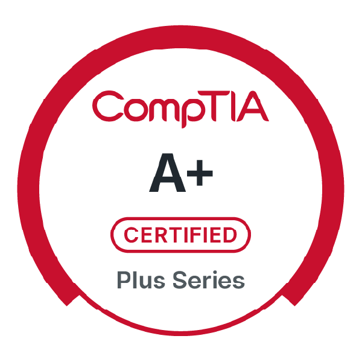

<html lang="en">
<head>
<meta charset="UTF-8">
<title>Khari Owens | SOC Analyst Portfolio</title>

</head>
<body>

<!-- Hero Section -->

  <h1>Khari Owens</h1>
  
SOC Analyst | Cybersecurity Enthusiast | Showcasing Threat Investigations, Reports, and Certifications

  <!-- First Updated Video -->
  

    <h2>Static Analysis in Reverse Engineering: A Deep Dive</h2>
    <iframe class="video-frame" src="https://player.vimeo.com/video/1114762484" allowfullscreen></iframe>
  

  <!-- Second Video -->
  

    <h2>🖥️ Event Log Threat Analysis</h2>
    <iframe class="video-frame" src="https://www.youtube.com/embed/YOUR_VIDEO_ID" allowfullscreen></iframe>
  

  <!-- Incident Reports -->
  

    <h2>📄 Incident Reports</h2>
    <ul>
      <li><a href="reports/phishing.pdf" target="_blank">Phishing Case Report (PDF)</a></li>
      <li><a href="reports/malware.pdf" target="_blank">Malware Alert Report (PDF)</a></li>
    </ul>
  

  <!-- Certifications -->
  

    <h2>🎓 Certifications</h2>
    

      
      
    

    <ul>
      <li>CompTIA Network+</li>
      <li>CompTIA CySA+ (in progress)</li>
      <li>CompTIA Project+</li>
      <li>SecurityX</li>
    </ul>
  

  <!-- Tools / Skills -->
  

    <h2>🛠️ Tools & Skills</h2>
    

      
      
      
      
      
    

  

  <!-- Contact -->
  

    <h2>📬 Contact Me</h2>
    
Connect or reach out:

    <a href="mailto:your.email@example.com">Email</a>
    <a href="https://www.linkedin.com/in/khariowens" target="_blank">LinkedIn</a>
    <a href="https://github.com/khyo121" target="_blank">GitHub</a>
  

</body>
</html>
